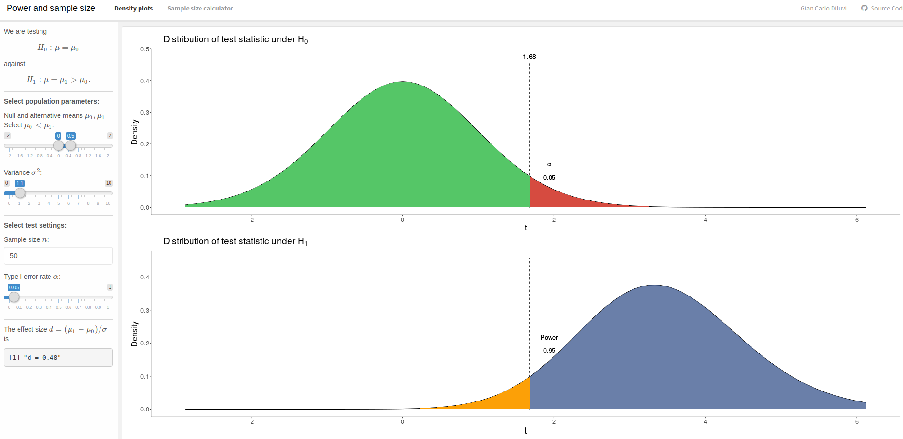
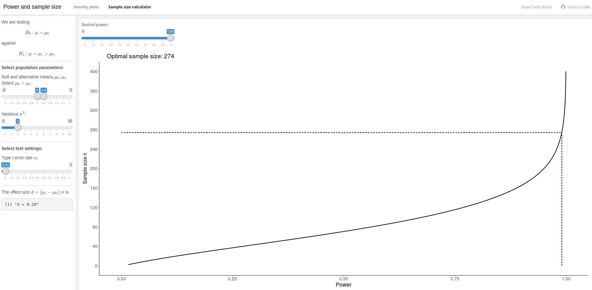

# Dashboard for power and sample size calculations
Gian Carlo Diluvi

## Context
In the context of hypothesis testing, statistical power is defined as the probability of rejecting the null hypothesis when it is indeed not true. Multiple factors come into play when calculating power: sensitivity, specificity, the size of the effect that is to be detected, and sample size.

This dashboard helps to visualize how these factors affect the power in a Normal hypothesis test, and includes an interactive sample size calculator.

## How to use
The dashboard is available here: [https://giankdiluvi.shinyapps.io/power/](https://giankdiluvi.shinyapps.io/power/) \
The folder `dashboard` includes the `R` code used for generating the dashboard.

